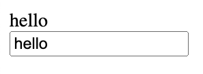

# React CDN sample

## Overview

- Reactのサンプルコードです
- Functional component + Hook をCDNで実現します
- 入門者向けの内容で、極力シンプルな機能にしています

## Prerequisites

- モダンなWebブラウザ（Chromeなど）さえあれば十分です
- Gitが使用できるとより良いです

## Installing

1. ローカルにHTMLをダウンロード
   - （Gitが使える場合）`git clone https://github.com/tgc624/react-cdn.git`
   - （Gitが使えない場合）同じフォルダの`sample.html`をコピペて、ローカルにHTMLファイルを作成する
2. ブラウザでHTMLファイルを開く
3. "hello"と2つ表示されていれば準備完了です

   

## Usage

- テキストボックスに入力・編集すると、すぐ上に同じ内容が表示されます

## Code description

- TBW

## How to lean react?

- Reactをきちんと学びたい場合は、公式ドキュメントを見るのが一番です
- Reactの公式ドキュメントは、学習教材としても非常に充実しています
- <https://ja.react.dev>
